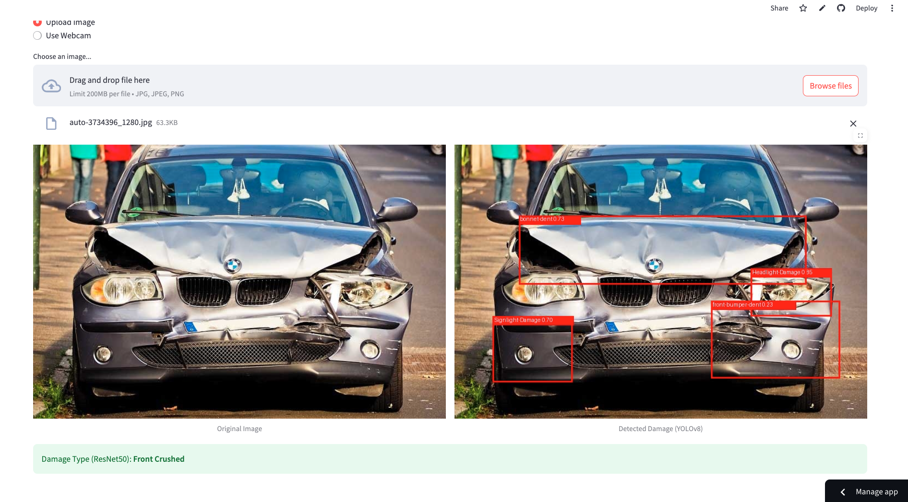

# Automated Car Damage Detection System
### Enterprise Computer Vision Solution for Vroom Car Rentals


**Live Demo:** [lalith-dabilpuram-vehicle-damage-detection.streamlit.app](https://lalith-dabilpuram-vehicle-damage-detection.streamlit.app/)

## Screenshots




---

## Overview

This repository contains an end-to-end computer vision pipeline designed to automate the vehicle inspection process for Vroom Car Rentals. The system replaces subjective, manual inspections with an objective deep learning pipeline that identifies and classifies exterior vehicle damage in real-time, delivering consistent and transparent results at scale.

The app runs two models in parallel on a single uploaded image:

- **ResNet-50** classifies the overall damage category (e.g. Front Crushed, Rear Breakage)
- **YOLOv8 (ONNX)** draws bounding boxes around the specific damaged components

---

## Problem Statement

Vroom Car Rentals requires a scalable method to assess vehicle condition upon return. Manual inspections are time-consuming, inconsistent, and frequently lead to customer disputes due to human error. This project addresses that gap by providing an automated diagnostic system that flags damage immediately at the point of return, ensuring accountability for both the company and the customer.

---

## Technical Approach

### Model 1 — ResNet-50 (Damage Classification)

Built on a ResNet-50 backbone pre-trained on ImageNet, fine-tuned to classify the overall type and location of vehicle damage.

- All convolutional layers frozen except `layer4` and the fully connected head
- Custom `Dropout + Linear` head for 6-class output
- Trained with cross-entropy loss and Adam optimizer

**Classification categories:**

| Label | Description |
|---|---|
| Front Normal | No damage at the front |
| Front Breakage | Glass or structural breakage at the front |
| Front Crushed | Structural crushing at the front |
| Rear Normal | No damage at the rear |
| Rear Breakage | Glass or structural breakage at the rear |
| Rear Crushed | Structural crushing at the rear |

### Model 2 — YOLOv8 (Damage Localisation)

A YOLOv8 object detection model exported to ONNX format that draws bounding boxes around 22 specific damage types on the vehicle surface. Inference runs directly via `onnxruntime` — no OpenCV or Ultralytics dependency required at runtime.

**Detectable damage types include:**

`front-bumper-dent` · `front-bumper-scratch` · `bonnet-dent` · `fender-dent` · `doorouter-dent` · `doorouter-scratch` · `Headlight-Damage` · `Taillight-Damage` · `Sidemirror-Damage` · `roof-dent` · `paint-chip` · `paint-trace` · `rear-bumper-dent` · `rear-bumper-scratch` · `Major-Rear-Bumper-Dent` · `quaterpanel-dent` · `pillar-dent` · `medium-Bodypanel-Dent` · `RunningBoard-Dent` · `Signlight-Damage` · `Front-Windscreen-Damage` · `Rear-windscreen-Damage`

---

## Project Structure

```
Car_Damage_Detection/
├── Streamlit_App/
│   ├── app_combined.py         # Main Streamlit app (ResNet + YOLO)
│   ├── model_helper.py         # Legacy inference helper
│   ├── best.onnx               # YOLOv8 ONNX weights
│   ├── packages.txt            # System-level apt dependencies
│   ├── requirements.txt        # Python dependencies
│   └── model/
│       └── saved_model_Car_Damage_Detection.pth  # ResNet-50 weights
├── training/
│   └── training_notebook.ipynb # Model training pipeline
└── README.md
```

---

## Tech Stack

| Component | Technology |
|---|---|
| Classification Model | ResNet-50 (PyTorch 2.5.1, Transfer Learning) |
| Detection Model | YOLOv8 (ONNX, onnxruntime) |
| Image Processing | Pillow, NumPy |
| Web Application | Streamlit 1.40 |
| Deployment | Streamlit Cloud |
| Language | Python 3.12 |

---

## Running Locally

```bash
cd Streamlit_App
pip install -r requirements.txt
streamlit run app_combined.py
```

---

## Future Direction: LLM-Powered Damage Analysis

The current system classifies and localises damage visually. The next evolution is to integrate a multimodal LLM — such as GPT-4o or a fine-tuned vision model — to generate detailed natural language damage reports.

The planned pipeline: ResNet identifies the damage category → YOLO pinpoints affected components → structured output is passed to an LLM → the LLM produces a human-readable report describing the specific nature and severity of the damage.

This combines the speed and precision of fine-tuned CNNs with the reasoning capability of modern LLMs, producing reports that are technically accurate and immediately actionable for non-technical staff.

---

## Insurance Industry Application

This system has direct applications in the automotive insurance sector. Insurance companies currently rely on manual field assessments — a process that is slow, expensive, and inconsistent.

An integrated pipeline would allow:

- Customer submits vehicle photos via mobile app or web portal
- Computer vision model classifies damage type and localises affected components
- LLM generates a structured damage report with component-level detail
- A cost estimation model recommends a repair cost and claim amount
- The full assessment completes in seconds, without a physical inspection

This would reduce claim processing time, lower operational costs, eliminate adjuster bias, and deliver faster and more transparent outcomes for customers.

---

## Roadmap

- **Phase 1 — Architecture Selection:** ResNet-50 with ImageNet backbone. `Completed`
- **Phase 2 — Model Training:** Fine-tuning on car damage dataset. `Completed`
- **Phase 3 — Object Detection:** YOLOv8 trained and exported to ONNX. `Completed`
- **Phase 4 — Deployment:** Combined ResNet + YOLO app deployed to Streamlit Cloud. `Completed`
- **Phase 5 — Validation:** Testing against real-world scenarios and varying lighting conditions. `In Progress`
- **Phase 6 — API Integration:** Service layer for automated damage reports in Vroom's check-in system. `Upcoming`
- **Phase 7 — LLM Integration:** Multimodal LLM for natural language damage descriptions. `Upcoming`
- **Phase 8 — Insurance Claim Prediction:** Cost estimation model for automated claim amounts. `Upcoming`

---

## Contact

For recruiters or collaborators interested in the technical implementation or project progress, please reach out via email at lalith.dabilpuram01@gmail.com
