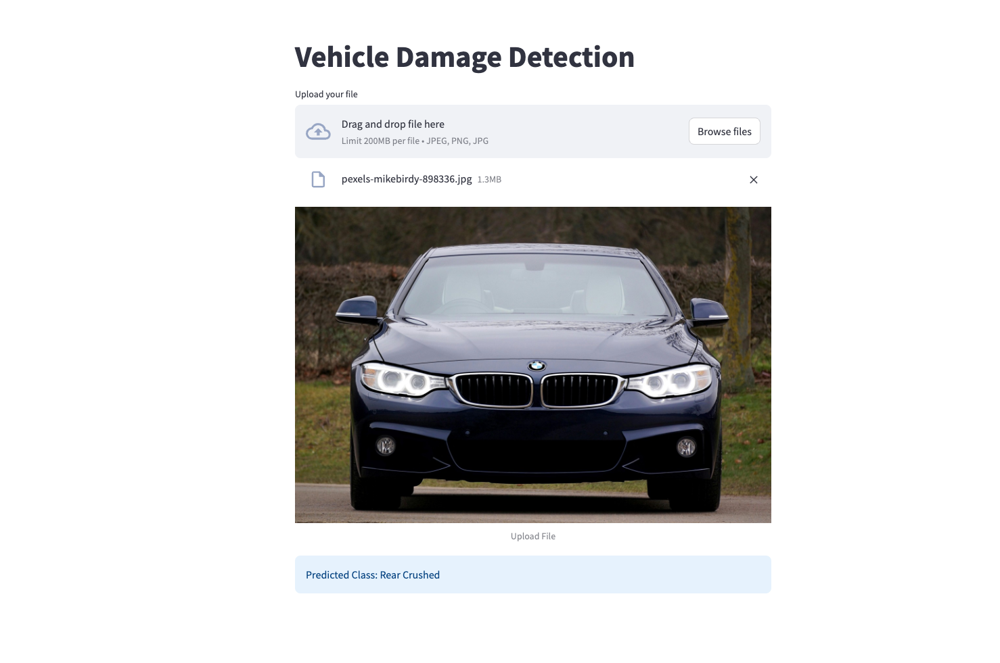

# Automated Car Damage Detection System
### Enterprise Computer Vision Solution for Vroom Car Rentals


**Live Demo:** [lalith-dabilpuram-vehicle-damage-detection.streamlit.app](https://lalith-dabilpuram-vehicle-damage-detection.streamlit.app/)

## Screensh




---

## Overview

This repository contains an end-to-end computer vision pipeline designed to automate the vehicle inspection process for Vroom Car Rentals. The system replaces subjective, manual inspections with an objective deep learning model that identifies and classifies exterior vehicle damage in real-time, delivering consistent and transparent results at scale.

---

## Problem Statement

Vroom Car Rentals requires a scalable method to assess vehicle condition upon return. Manual inspections are time-consuming, inconsistent, and frequently lead to customer disputes due to human error. This project addresses that gap by providing an automated diagnostic system that flags damage immediately at the point of return, ensuring accountability for both the company and the customer.

---

## Technical Approach

### Transfer Learning on ImageNet
The system is built on a ResNet-50 backbone pre-trained on ImageNet. This provides a strong visual feature foundation — understanding edges, textures, and structural shapes — which is then fine-tuned to detect domain-specific automotive damage such as panel crushing, glass breakage, and surface deformation.

### Architecture: Fine-Tuned ResNet-50
- All convolutional layers are frozen except `layer4` and the fully connected head
- The classifier head is replaced with a custom `Dropout + Linear` layer for 6-class output
- Training uses cross-entropy loss with Adam optimizer

### Classification Categories
The model classifies vehicle damage into six categories:

| Label | Description |
|---|---|
| Front Normal | No damage detected at the front |
| Front Breakage | Glass or structural breakage at the front |
| Front Crushed | Structural crushing at the front |
| Rear Normal | No damage detected at the rear |
| Rear Breakage | Glass or structural breakage at the rear |
| Rear Crushed | Structural crushing at the rear |

### Deployment
The trained model is served through a Streamlit web application, allowing rental agents to upload a vehicle image and receive an instant damage classification. The app is deployed on Streamlit Cloud and accessible via the link above.

---

## Project Structure

```
Car_Damage_Detection/
├── Streamlit_App/
│   ├── app.py                  # Streamlit frontend
│   ├── model_helper.py         # Inference logic
│   ├── requirements.txt        # Dependencies
│   └── model/
│       └── saved_model_Car_Damage_Detection.pth
├── training/
│   └── training_notebook.ipynb # Model training pipeline
└── README.md
```

---

## Tech Stack

| Component | Technology |
|---|---|
| Deep Learning Framework | PyTorch 2.5.1 |
| Model Architecture | ResNet-50 (Transfer Learning) |
| Image Processing | Torchvision, Pillow |
| Web Application | Streamlit |
| Deployment | Streamlit Cloud |
| Language | Python 3.12 |

---

## Future Direction: LLM-Powered Damage Analysis

The current system classifies damage into broad categories. The next evolution of this project is to integrate a Large Language Model (LLM) — such as GPT-4 Vision or a fine-tuned multimodal model — to move beyond classification and into detailed natural language damage reporting.

The planned pipeline works as follows: the ResNet model first identifies the region and type of damage, and this output is then passed as structured context to an LLM. The LLM analyzes the image alongside the classification result to generate a detailed, human-readable damage report describing the specific nature of the damage — for example, distinguishing between a minor paint scuff, a cracked bumper, or a buckled hood panel.

This approach combines the speed and precision of a fine-tuned CNN with the reasoning and language capabilities of a modern LLM, producing reports that are both technically accurate and immediately actionable for non-technical staff.

---

## Insurance Industry Application

This system has direct and significant applications in the automotive insurance sector. Insurance companies currently rely on manual assessments by field adjusters to evaluate vehicle damage and determine claim payouts — a process that is slow, expensive, and prone to inconsistency.

By integrating this computer vision pipeline with an LLM-based reporting layer, insurers could automate the end-to-end claims workflow:

- A customer submits photos of their damaged vehicle through a mobile app or web portal
- The computer vision model instantly classifies the type and location of the damage
- The LLM generates a structured damage report with granular details about the affected components
- Based on the damage report, a trained prediction model estimates the repair cost and recommends an appropriate insurance claim amount
- The entire assessment is completed in seconds, without requiring a physical inspection

This would dramatically reduce claim processing time, lower operational costs, eliminate adjuster bias, and provide customers with faster, more transparent outcomes. For high-volume insurers processing thousands of claims daily, this pipeline represents a meaningful step toward fully automated claims adjudication.

---

## Roadmap

- **Phase 1 — Architecture Selection:** ResNet-50 with ImageNet backbone. `Completed`
- **Phase 2 — Model Training and Refinement:** Fine-tuning on car damage dataset, handling false positives. `Completed`
- **Phase 3 — Deployment:** Streamlit app deployed to cloud. `Completed`
- **Phase 4 — Validation:** Testing against real-world rental return scenarios and varying lighting conditions. `In Progress`
- **Phase 5 — API Integration:** Building a service layer to generate automated damage reports for Vroom's check-in system. `Upcoming`
- **Phase 6 — LLM Integration:** Connecting a multimodal LLM to generate detailed natural language damage descriptions from model output. `Upcoming`
- **Phase 7 — Insurance Claim Prediction:** Training a cost estimation model to predict repair costs and automate insurance claim amounts based on damage analysis. `Upcoming`

---

## Contact

For recruiters or collaborators interested in the technical implementation or project progress, please reach out via the contact information on my [GitHub profile](https://github.com/lalithdabilpuram01).
